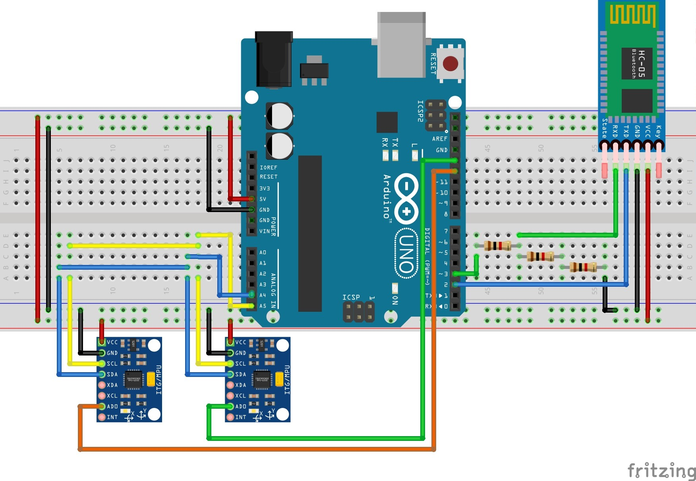

# Tavanyar (Arduino)

Tavanyar is a system which detects and evaluates physical therapy exercises automatically using motion
tracking devices. This project consists of two parts: a piece of hardware and some kind of user interface.
This code is the hardware-side of the project.
 
## Diagram

## Data flow
Two-way communication between hardware and user interface is made possible via bluetooth device:

1. Hardware -> User interface:

    Hardware can send 25 samples per second to the user interface. Each sample consists of the acceleration
towards x, y, and z axes of each device obtained by accelerometers, and the angular velocity around
x, y, and z axes of each device obtained by gyroscopes.

2. User interface -> Hardware:

    User interface can send commands to the hardware and configure the system. It can pause and resume
sending data, and also specify the number of motion tracking devices being used.

## Specifications
The hardware consists of:

1. One Arduino Uno as micro-controller
2. Multiple (currently 2) MPU-6050 modules as motion tracking devices
3. One HC-05 module as bluetooth device

### Arduino Uno specifications

- Clock frequency: the standard mode (100 KHz)
- Uses software serial protocol for debugging
- UART serial protocol standard: 8N1
- UART serial protocol baud rate: 38400 bps

### MPU-6050 specifications
- Accelerometer:
    - Full-scale range: +/-8 g
    - Sensitivity: 4096 LSB/g
    - Low pass filter:
        - Frequency: 5 Hz
        - Delay: 19 ms
    - Output rate: 1 KHz
- Gyroscope:
    - Full-scale range: +/-1000 dps
    - Sensitivity: 32.8 LSB/dps
    - Low pass filter:
        - Frequency: 5 Hz
        - Delay: 18.6 ms
    - Output rate: 1 KHz
- Sampling:
    - Frequency: 25 Hz
    - Divider: 39
- Clock reference: x axis of gyroscope
- Current consumption: 3.8 mA
- Uses digital input/output pins D13-D4 as address pins
- Uses 0x68 I2C address for the module under communication and 0x69 I2C address for other modules

### HC-05 specifications
- Name: TAVANYAR
- Password: 123456
- Uses software serial protocol for communication
- UART serial protocol standard: 8N1
- UART serial protocol baud rate: 38400 bps
- role: slave

### Note 1.
It is assumed that MPU-6050 modules are calibrated, and the corresponding calibration offsets are fed into the
system as well, all before running the sketch.

See this link in order to calibrate MPU-6050 modules and obtain calibration offsets:
https://github.com/melikabarzegaran/mpu6050-raw-calibration

### Note 2.
It is assumed that HC-05 module is configured before running the sketch.

See this link in order to configure HC-05 module:
https://github.com/melikabarzegaran/hc05-configuration

### Note 3.
We use 2 MPU-6050 modules with ASCII output format in the system, for the sake of simplicity and easy
debugging. For such a system, according to the table below, 38400 bps would be enough as serial baud rate.
Consider raising serial baud rate or shifting to binary output format when using more than 3 MPU-6050 modules.

|                      | 9600 bps | 19200 bps | 38400 bps | 57600 bps | 74880 bps | 115200 bps |
|:--------------------:|:--------:|:---------:|:---------:|:---------:|:---------:|:----------:|
| binary output format |     1    |     3     |     6     |     9     |     12    |     19     |
|  ASCII output format |     -    |     1     |     3     |     4     |     6     |      9     |